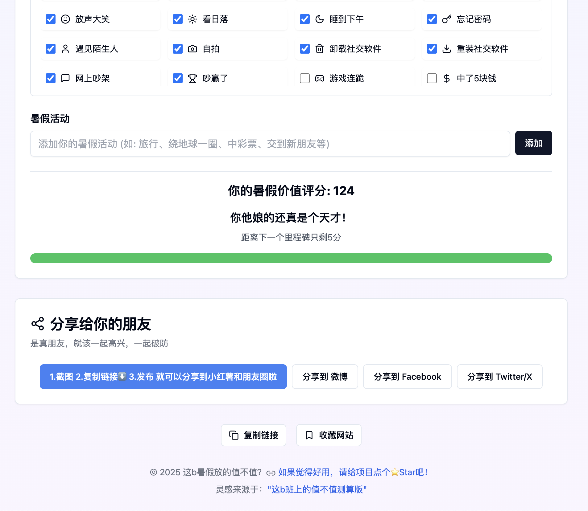

# 这b暑假放的值不值 - 暑假价值计算器 🎯

一个有趣的网页应用，帮助你计算暑假过得值不值！

   

  

## 🎮 如何使用

1. 设置你的暑假起止日期
2. 勾选你完成的成就
3. 添加你的暑假活动
4. 查看你的暑假价值评分和评价
5. 分享给你的朋友一起玩

## 💯 计分规则

### 基础分（最高29分）
- 有暑假作业：根据完成度计算（0-29分）
- 没有暑假作业：直接得29分

### 大成就（每个10分）
- 找到实习
- 去旅行
- 脱单了
- 保研了
- 出国留学
- 找到工作
- 中彩票
- 学会新技能
- 交到新朋友

### 小成就（每个3分）
每完成一个日常小事情得3分，包括：
- 打游戏、刷抖音、发呆
- 吃喝玩乐（吃好吃的、喝咖啡、看电影等）
- 生活琐事（充电、修东西、骑车等）
- 社交活动（点赞、发朋友圈、网上吵架等）
- 情感体验（开心、难过、无聊等）

### 自定义活动（每个10分）
- 可以添加自己的暑假活动，每个活动加10分

## 🏆 评分标准

- 0分：建议退学
- 1-28分：暑假太不值了
- 29-38分：要再加把劲
- 39-48分：勉强及格
- 49-58分：还行，没浪费
- 59-68分：不错有点东西
- 69-78分：暑假卷王
- 79-88分：你怎么不上天呢？
- 89-98分：神仙下凡辛苦了
- 99+分：你他娘的还真是个天才！

记住：生活中的每一个小事都很重要，不要觉得刷抖音、发呆这些事情没有意义。暑假就是用来放松和享受的，做自己喜欢的事情才最值得！
