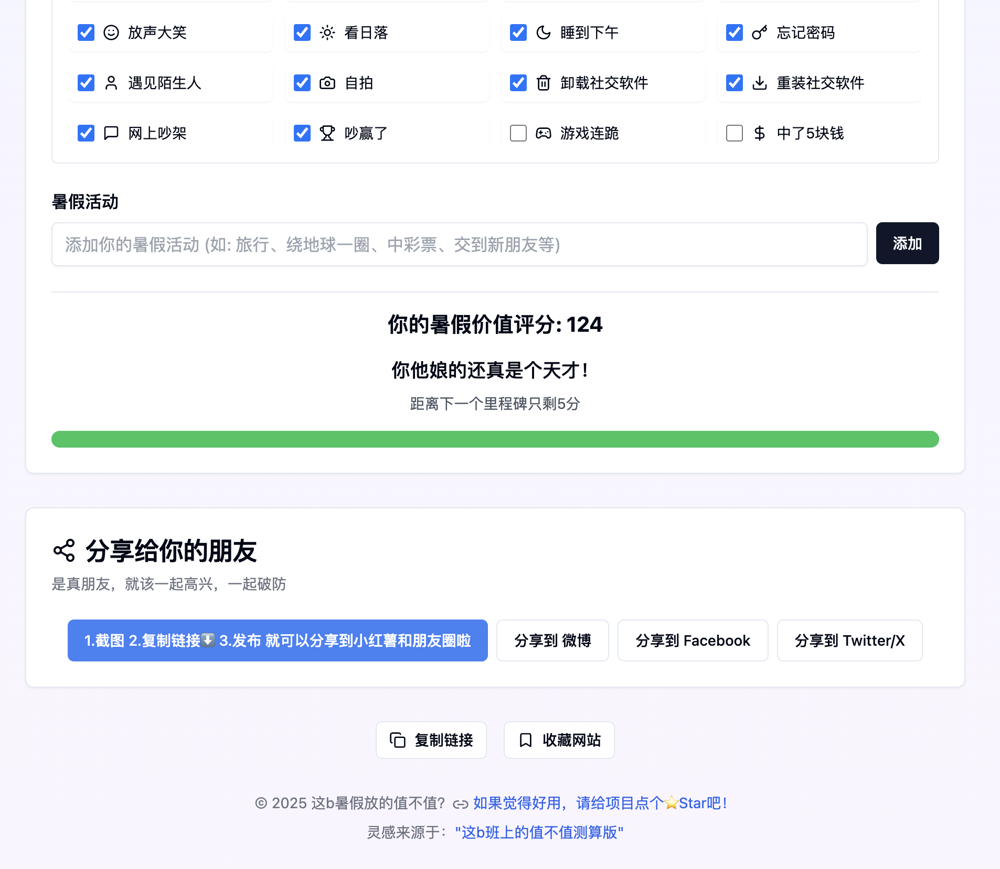

# Summer Vacation Value Calculator 🎯

An interesting web application that helps you calculate whether your summer vacation was worth it!

   

  

## 🎮 How to Use

1. Set your summer vacation start and end dates
2. Check off the achievements you've completed
3. Add your summer activities
4. View your summer vacation value score and evaluation
5. Share with your friends to play together

## 💯 Scoring Rules

### Base Score (up to 29 points)
- Have summer homework: calculated based on completion (0-29 points)
- No summer homework: get 29 points directly

### Major Achievements (10 points each)
- Found an internship
- Went traveling
- Got into a relationship
- Got accepted into a graduate program
- Studying abroad
- Found a job
- Won the lottery
- Learned a new skill
- Made new friends

### Minor Achievements (3 points each)
Get 3 points for each small daily task completed, including:
- Playing games, watching TikTok, zoning out
- Eating and drinking (good food, coffee, movies, etc.)
- Chores (charging devices, fixing things, cycling, etc.)
- Social activities (liking posts, posting on social media, arguing online, etc.)
- Emotional experiences (happy, sad, bored, etc.)

### Custom Activities (10 points each)
- You can add your own summer activities, each adding 10 points

## 🏆 Scoring Standard

- 0 points: Suggest dropping out
- 1-28 points: Summer vacation was not worth it
- 29-38 points: Need to work harder
- 39-48 points: Barely passing
- 49-58 points: Not bad, not wasted
- 59-68 points: Pretty good
- 69-78 points: Summer vacation master
- 79-88 points: Are you trying to ascend to the heavens?
- 89-98 points: A deity descended to the mortal realm
- 99+ points: You're a damn genius!

Remember: Every little thing in life is important. Don't think that things like watching TikTok or zoning out are meaningless. Summer vacation is for relaxing and enjoying yourself. Doing what you love is what's most worthwhile!